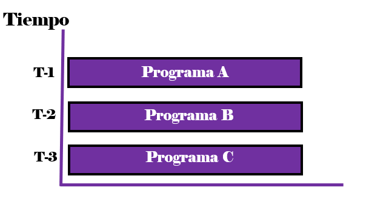

# TEMA 1: Concurrencia y Procesos

## Proceso vs Programa
Para que un programa se ejecute, el SO debe crear un proceso para él.
- `Programa`: Secuencia estática de instrucciones escrita en un lenguaje dado, es una instancia de ejecución de un programa.
- `Proceso`: Instancia dinámica de la ejecución de un programa, caracterizado por su contador de programa, estado, registros, pila, datos, etc.
- Un **programa** puede ser ejecutado por varios usuarios, lo que crea varios **procesos** independientes que comparten código pero tienen su propio estado.
Un `sistema` es una coleción de **procesos** que podrían ejecutarse concurrentemente.

## Concepto de Proceso
Un proceso es cualquier programa en ejecución el cual, no solo incluye el código, sino también:
- `Sección de texto`: Código del programa.
- `Actividad actual`: Incluye el contador de programa y los registros del procesador.
- `Imagen de memoria`:
  - **Pila (stack)**: Contiene datos temporales.
  - **Sección de datos**: Contiene _variables globales_ y _memoria dinámica_.

## Recursos de un Proceso
Un proceso necesita ciertos recursos para completar su tarea:
- `CPU`, `Memoria`, `Archivos`, `Dispositivos de E/S`
- Los recursos se asignan cuando se **crea** o **durante su ejecución**.

## Hilos y Concurrencia
Un proceso puede dividirse en `tareas independientes (hilos)` que se ejecutan de manera concurrente en una misma máquina. 
El sistema operativo gestiona la concurrencia con funciones como:
- `Creación y eliminación de procesos`.
- `Planificación de procesos` para maximizar el uso del procesador.
- `Sincronización y comunicación entre procesos`.
- `Manejo de excepciones e interrupciones`: control de errores.
- `Asignación de recursos hardware a diferentes procesos`, son compartidos tanto por los programas como por los diferentes usuarios.
  
## Programación Concurrente
Permite ejecutar múltiples tareas al mismo tiempo:
- `Multiprogramación` en un solo procesador: El sistema operativo intercambia los procesos rápidamente,
  creando la ilusión en el usuario de que se ejecutan simultáneamente.  
  Si existe un único procesador, solo un **proceso** puede estar en un **momento determinado en ejecución**.    
**Por ejemplo**, imaginemos que estamos editando un archivo en un bloc de notas mientras se esta ejecutando en segundo plano el reproductor de música donde: 
  - La `memoria` contiene los programas en espera de ser ejecutados.
  - El `CPU` ejecuta uno de los programas a la vez, alternando entre ellos.
  - Y los `tiempos` (T1, T2, etc.) muestran cómo el CPU asigna tiempo a cada programa.
<table>
  <tr>
    <td width="50%">
      
    </td>
    <td width="50%">
      
    </td>
  </tr>
</table>

  
- `Multitarea` en varios núcleos: Cada núcleo puede ejecutar diferentes instrucciones al mismo tiempo,
  y los núcleos comparten la misma memoria, lo que permite la **programación paralela**.
La `programación paralela` permite mejorar el rendimiento de un programa si se ejecuta de forma paralela en diferentes núcleas
ya que permite que se ejecuten varias instrucciones a la vez.    
**Por ejemplo**, imaginemos que estamos editando un archivo en un bloc de notas mientras se esta ejecutando en segundo plano el reproductor de música donde:
  - En la `memoria` hay un solo programa cargado, pero este programa puede tener varios hilos (A, B, C) que se ejecutan simultáneamente, donde cada hilo puede realizar tareas diferentes.
    - **Hilo A**: Interfaz de usuario.
    - **Hilo B**: Recepción de mensajes.
    - **Hilo C**: Gestión de llamadas.
  - En la ejecución, la `CPU`, alterna entre los hilos de la misma aplicación, permitiendo que diferentes tareas se ejecuten simultáneamente. 
<table>
  <tr>
    <td width="50%">
      
    </td>
    <td width="50%">
      
    </td>
  </tr>
</table>

## Tipos de Concurrencia
1. `Concurrencia Real`: Las instrucciones de varios procesos se solapan en el tiempo. Requiere múltiples procesadores físicos.
2. `Concurrencia Simulada` (**Pseudoparalelismo**): Las instrucciones de varios procesos se intercalan en el tiempo en un mismo procesador.
   Los procesadores se multiplexan entre los procesos.

**Por ejemplo**:
| **Concurrencia Real**  | **Concurrencia Simulada** |
|:-----------------------:|:-------------------------:|
|  |  |
| Se asemeja a la **multiprogramación** en el sentido de que varios programas o procesos están en memoria, pero en la `concurrencia real`, todos se están ejecutando simultáneamente en diferentes CPUs. | Se parece a la **multitarea**, donde un solo CPU alterna entre múltiples hilos o tareas dentro de un mismo programa, permitiendo que parezca que se están ejecutando al mismo tiempo. |

## Programación Distribuida
Se ejecutan programas en múltiples ordenadores conectados en red, cada uno con su propio procesador y memoria. 
La comunicación entre procesos se realiza mediante redes, lo que es más complejo que el intercambio de memoria compartida.

<table>
  <tr>
    <td width="65%">
    
<b>Por ejemplo</b>:  
      - Cada <b>nodos</b> tiene su propia <b>memoria</b> y <b>CPU</b> donde se ejecutan diferentes procesos (A, B, C, E, F). 
      - En la <b>red</b>, los nodos están conectados a través de una red, lo que permite la comunicación entre ellos.

    </td>
    <td width="35%">
      
    </td>
  </tr>
</table>

---

>_IES Ribera de Castilla 24/25._

